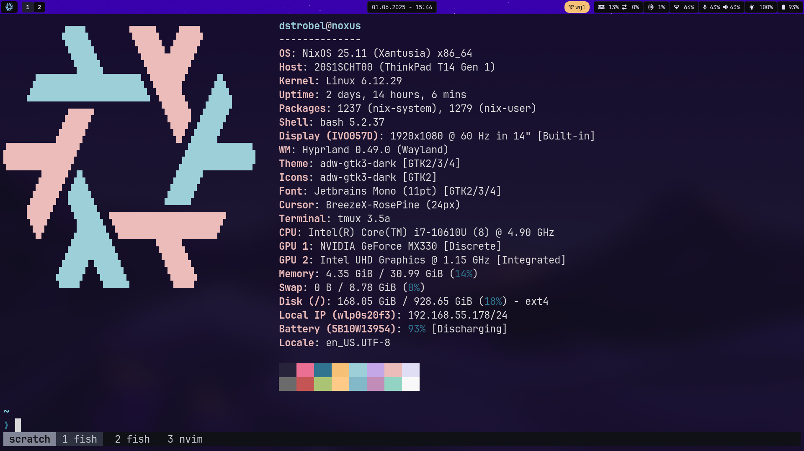
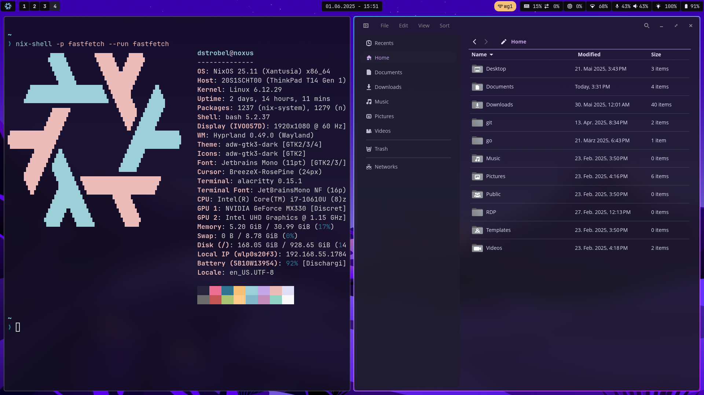

<!-- Logo -->
<p align="center">
<a href="https://nixos.org"></a>
</p>

<!-- Badges -->
<p align="center">
    <a href="https://github.com/d-strobel/nix-config/actions/workflows/test.yml">
        
    </a>
    <a href="https://github.com/NixOS/nixpkgs">
        
    </a>
</p>

<!-- Headline and short description -->
<h1 align="center">nix-config</h1>
<p align="center"><i>Personal NixOS configuration.</i>.</p>

## Screenshots




## Installation

> This is the most simple installation method for me right now.

1. Install NixOS via GUI Installer (e.g. Gnome)
1. Install without any WindowManager
1. Use the correct user + password (User should be admin as well)
1. Activate LUKS encryption
1. Boot into the system
1. Login with the user
1. Connect to Wifi: `nmcli device wifi connect <SSID> password <PASSWORD>` OR `nmtui`
1. Create temporary shell: `nix-shell -p vim git home-manager`
1. Clone this repo: `git clone https://github.com/d-strobel/nix-config.git`
1. Install system flake: `sudo nixos-rebuild switch --experimental-features 'nix-command flakes' --flake .#HOST`
1. Install home configuration: `home-manager switch --flake .#USER`
1. Reboot

## Update

In order to update a system run the following commands.

```bash
# 1. Update the nix flake
nix flake update

# 2. Rebuild the system
sudo nixos-rebuild switch --flake .#HOST

# 3. Rebuild the Home-Manager
home-manager switch --flake .#USER

# 4. Optional: Gargabe collection
sudo nix-collect-garbage -d
```

## Inspirations

* [youtube.com/@vimjoyer](https://www.youtube.com/@vimjoyer)
* [nixalted.com/](https://nixalted.com/)
* [github.com/Andrey0189/nixos-config-reborn](https://github.com/Andrey0189/nixos-config-reborn/tree/master)
* [github.com/yavko/Dotfiles](https://github.com/yavko/Dotfiles)
